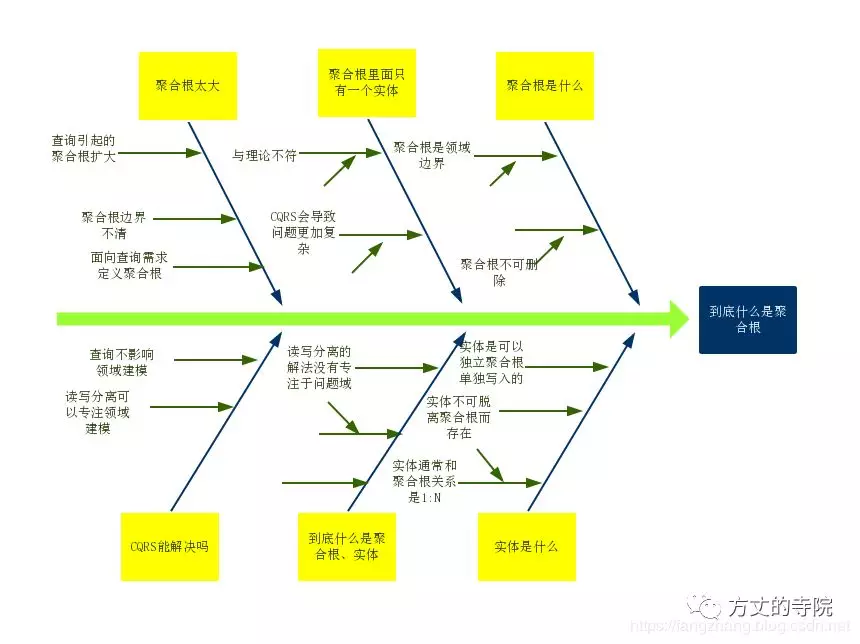

# 背景
之前有同事在分享DDD在闲鱼商品详情页的实践时，大家对闲鱼团队领域建模关于商品详情页的聚合根建模表示不认同。

>因为这是面向页面建模，不是面向领域建模，将微服务拆分和领域建模混为一谈了

于是我以聚合根定义作为引子，结合组内在实践DDD过程中，聚合根随着业务查询复杂而导致聚合根不断膨胀的问题，提出借鉴CQRS读写分离的理念，来解这个问题。
详见DDD-CQRS能解聚合根的问题吗引发了大家对领域模型的重新思考和激励讨论。历经3小时得出了一些结论，达成了共识。

# 过程

通常我们说领域建模不应该去考虑微服务架构，工程结构，应该专注于业务。

但在实践过程中发现这并不是一个好的方式，或者说是可落地的。因为业务领域建模完成后，还是要反映到系统架构中，

最终是要落地到代码实现，通过代码来表达出领域模型。所以说我们的讨论不应该是脱离

系统架构的。但是当我们发现业务领域建模完，通过代码实践一段时间后，发现代码模型腐化了，这时候

我们首先思考的方向不应该是通过代码来纠正，而是应该回归到业务建模。

# 结论
###聚合根

- 聚合根代表的是一个领域边界

- 聚合根的内容要保证数据一致性（这里的一致性指的不是数据持久化的事务一致性，而是业务数据的一致性，包含业务上的业务校验）
比如订单和订单详情，一个没有订单详情的订单是不完整的

- 聚合根里面有多少个实体，由领域建模决定

- 永远不要删除聚合根

聚合根之间有引用，如果删除了聚合根，会导致关联聚合的数据不一致

这边很容易和实体的生命周期从属于聚合根搞混了。这边的依赖是关联依赖，实体依赖聚合根是has a

聚合根引用聚合根值id/或者id值对象

### 实体

- 实体一般从属于某个聚合根，要不然就可以定义成聚合根了

- 实体有自己的生命周期，他的生命周期从属于聚合根。也就是聚合根没有，实体也就没了

比如我可以对订单详情的数据进行编辑，删除。

- 聚合根与实体的关系通常是1:N

因为如果是1:1,通常不需要定义实体了。直接放在聚合根里面，不需要唯一id了。
注意，聚合根里面没有实体，并不意味着数据库就只有一张表，可以设计成多张表。DB设计和领域建模没有关系
可以单独更新聚合根中实体数据不是说只能有一个方法saveAggr(),可以有saveEntity()方法

## 案例
###case 1:

品牌信息和店铺

店铺依赖品牌，但是店铺有自己独立的生命周期。他们的数据没有一致性要求。所以店铺是一个聚合根

###case 2: 门店与门店商品

门店商品有自己的价格，返佣。需要单独编辑，是一个实体。脱离了门店后没有生命终结。

下期问题
目前我们只讨论了实体类型的聚合根，没有讨论业务过程的聚合根，比如转账

#引用
https://www.jianshu.com/p/e6c2fdef8db6